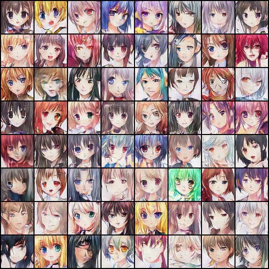

# DCGAN Anime Face Generator



## 📌 Project Overview
This project implements a **Deep Convolutional Generative Adversarial Network (DCGAN)** trained to generate 64×64 anime faces. The model is trained on a curated dataset of **21,551 manually cropped and resized anime face images**, allowing the generator to learn core visual patterns such as eye shape, hair style, color palettes, and facial proportions.

The system consists of:
* **A Generator** that transforms random noise vectors into 64×64 RGB anime-style faces using transposed convolutions, batch normalization, and ReLU activations.
* **A Discriminator** that distinguishes real anime faces from generated ones using strided convolutions and LeakyReLU activations.

Both networks are trained in an adversarial setup using the Adam optimizer and standard DCGAN training heuristics. After around 50 epochs, the generator becomes capable of producing high-quality, aesthetically coherent anime faces with diverse styles.

This repository contains the training notebook, the pre-trained model weights, and visualization scripts, enabling anyone to understand, reproduce, and extend the DCGAN-based anime face generator.

---

## 📂 Dataset
The model was trained on the **Anime Faces** dataset sourced from Kaggle.
* **Source:** [Anime Faces on Kaggle](https://www.kaggle.com/datasets/soumikrakshit/anime-faces)
* **Content:** 21,551 PNG images.
* **Preprocessing:** All images were normalized to a range of `[-1, 1]` and resized to `64x64` pixels to match the DCGAN input requirements.

---

## ⚙️ Technical Methodology

### Architecture
The project follows the architectural guidelines proposed in the original DCGAN paper (Radford et al.):
* **Latent Vector ($z$):** Size 128 (Input noise).
* **Generator:** Uses `ConvTranspose2d` layers to upsample noise to an image.
    * Activation: `ReLU` for all layers, `Tanh` for the final output layer to map to [-1, 1].
* **Discriminator:** Uses `Conv2d` layers with strided convolutions to downsample images.
    * Activation: `LeakyReLU` (slope 0.2) to prevent "dying ReLU" problems.
    * Output: `Sigmoid` function (probability 0 to 1).

### Training Configuration
* **Environment:** Google Colab (T4 GPU).
* **Epochs:** 50
* **Batch Size:** 128
* **Loss Function:** Binary Cross Entropy Loss (`BCELoss`).
* **Optimizer:** Adam
    * Learning Rate (`lr`): `0.0002`
    * Beta1: `0.5` (Stabilizes training compared to the default 0.9).

---

## 🚀 How to Run

### 1. View the Notebook
The entire training process, from data loading to visualization, is documented in the Jupyter Notebook:
* Open `4004GenAIProject.ipynb`

### 2. Use Pre-trained Weights (No Training Required)
You can generate new faces immediately using the provided `.pth` file without waiting for training.

```python
import torch
import torch.nn as nn

# 1. Define the Generator Class (Must match training architecture)
class Generator(nn.Module):
    def __init__(self):
        super(Generator, self).__init__()
        self.main = nn.Sequential(
            nn.ConvTranspose2d(128, 512, 4, 1, 0, bias=False),
            nn.BatchNorm2d(512),
            nn.ReLU(True),
            nn.ConvTranspose2d(512, 256, 4, 2, 1, bias=False),
            nn.BatchNorm2d(256),
            nn.ReLU(True),
            nn.ConvTranspose2d(256, 128, 4, 2, 1, bias=False),
            nn.BatchNorm2d(128),
            nn.ReLU(True),
            nn.ConvTranspose2d(128, 64, 4, 2, 1, bias=False),
            nn.BatchNorm2d(64),
            nn.ReLU(True),
            nn.ConvTranspose2d(64, 3, 4, 2, 1, bias=False),
            nn.Tanh()
        )
    def forward(self, input):
        return self.main(input)

# 2. Load Model
device = torch.device('cuda' if torch.cuda.is_available() else 'cpu')
model = Generator().to(device)
model.load_state_dict(torch.load('anime_generator.pth', map_location=device))

# 3. Generate Image
noise = torch.randn(1, 128, 1, 1, device=device)
fake_image = model(noise)
```

📊 Results
The training progression shows a clear evolution from random noise to coherent faces. The image above (epoch_50.png) demonstrates the capability of the model after the full training cycle.

🤝 Credits
Dataset provided by Soumik Rakshit.

Implementation inspired by standard PyTorch DCGAN tutorials
